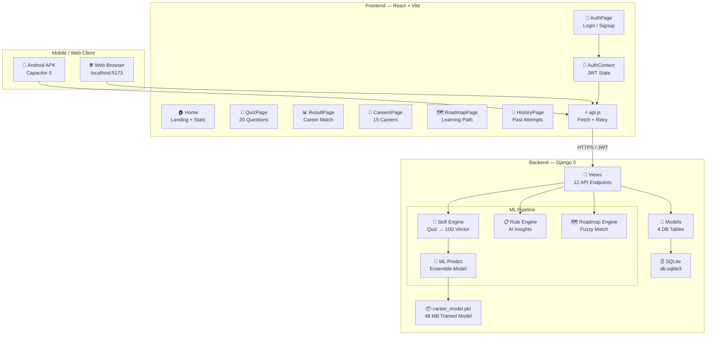
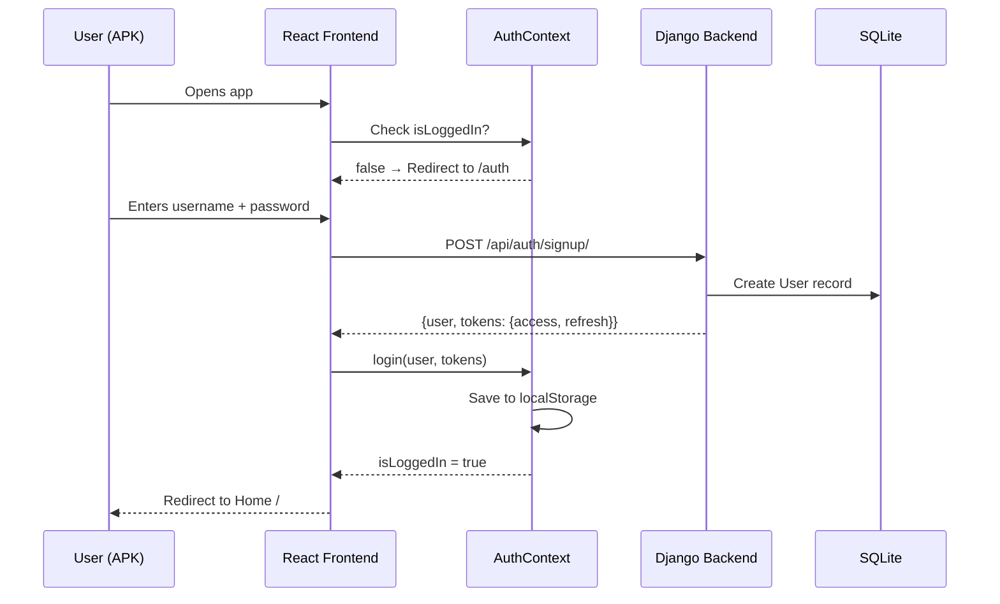
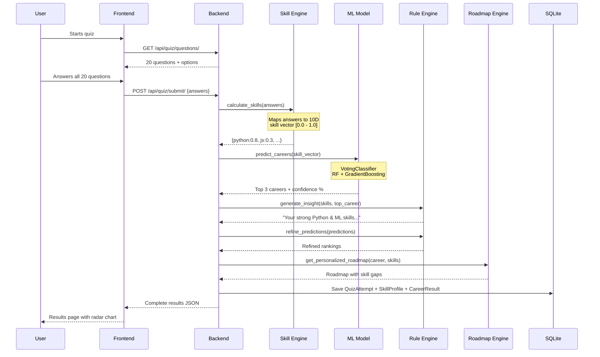
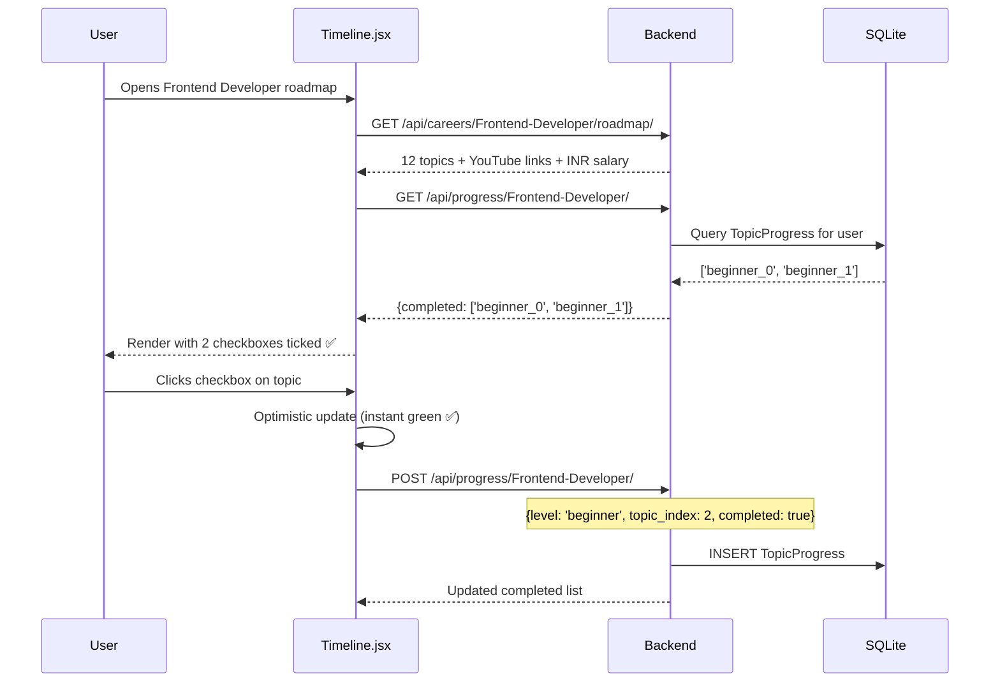
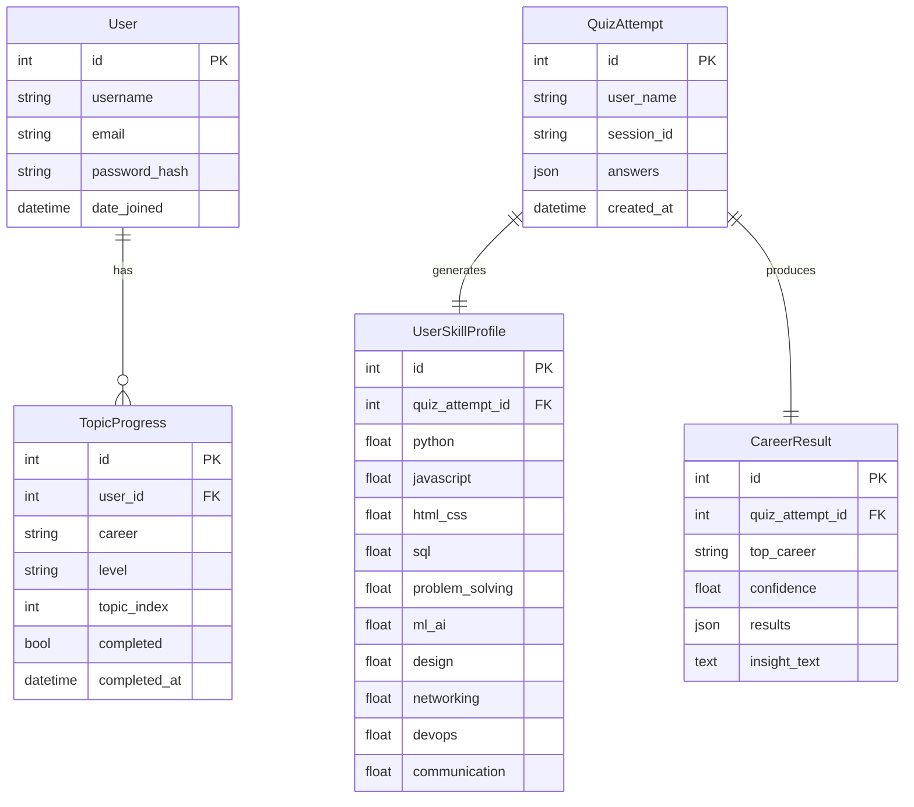
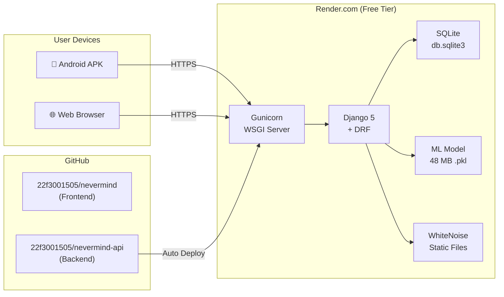

# Never Mind — AI Career Intelligence Platform

## Complete Project Architecture & Documentation

---

## 1. Project Overview

**Never Mind** is a production-grade, ML-powered career prediction platform that recommends the best IT career path for users based on their skill assessment. Users take a 20-question quiz, and an ensemble machine learning model analyzes their responses across 10 skill dimensions to predict their ideal career from 15 IT roles — with confidence scores, personalized insights, learning roadmaps, YouTube tutorials, and progress tracking.

### Key Numbers

| Metric | Value |
|---|---|
| Career Roles | 15 |
| Quiz Questions | 20 |
| Skill Dimensions | 10 |
| Training Samples | 2,100+ |
| Roadmap Topics | 180 (12 per career) |
| YouTube Tutorials | 180 links |
| API Endpoints | 12 |
| APK Size | 3.3 MB |

---

## 2. Tech Stack

| Layer | Technology | Purpose |
|---|---|---|
| **Frontend** | React 18 + Vite 5 | Single Page Application |
| **Styling** | Tailwind CSS | Monochrome dark theme |
| **Animations** | Framer Motion | Page transitions, micro-interactions |
| **Mobile** | Capacitor 6 | Android APK wrapper |
| **Backend** | Django 5 | REST API server |
| **API Framework** | Django REST Framework | Serialization, views, throttling |
| **Authentication** | SimpleJWT | JWT token-based auth |
| **ML Model** | Scikit-learn | VotingClassifier (RF + GradientBoosting) |
| **Data Processing** | Pandas, NumPy, SciPy | Feature engineering, normalization |
| **Database** | SQLite | User data, quiz attempts, progress |
| **Production Server** | Gunicorn + WhiteNoise | WSGI + static files |
| **Cloud Hosting** | Render.com | Backend deployment |
| **Version Control** | GitHub | 2 repositories |

---

## 3. Architecture Diagram



---

## 4. Project Structure

```
career-path-recommendation-system-main/
├── Frontend/                          # React + Vite + Capacitor
│   ├── src/
│   │   ├── App.jsx                    # Router + Auth guard
│   │   ├── main.jsx                   # Entry point
│   │   ├── index.css                  # Tailwind + design tokens
│   │   ├── context/
│   │   │   └── AuthContext.jsx        # JWT state management
│   │   ├── services/
│   │   │   └── api.js                 # API layer (retry, timeout)
│   │   ├── components/
│   │   │   ├── pages/
│   │   │   │   ├── AuthPage.jsx       # Login / Signup
│   │   │   │   ├── Home.jsx           # Landing page
│   │   │   │   ├── QuizPage.jsx       # 20-question quiz
│   │   │   │   ├── ResultPage.jsx     # Career results + radar
│   │   │   │   ├── CareersPage.jsx    # Browse 15 careers
│   │   │   │   ├── RoadmapPage.jsx    # Career roadmap detail
│   │   │   │   └── HistoryPage.jsx    # Past quiz attempts
│   │   │   ├── roadmap/
│   │   │   │   └── Timeline.jsx       # Roadmap timeline + checkboxes
│   │   │   ├── charts/
│   │   │   │   └── SkillRadar.jsx     # 10-axis radar chart
│   │   │   └── Loader.jsx             # Loading spinner
│   │   ├── hooks/
│   │   │   └── useQuiz.js             # Quiz state management
│   │   └── utils/                     # Helper functions
│   ├── android/                       # Capacitor Android project
│   │   ├── app/
│   │   │   ├── build.gradle           # Android build config
│   │   │   └── src/main/
│   │   │       ├── AndroidManifest.xml
│   │   │       └── res/               # Icons, splash screens
│   │   └── nevermind-release.keystore # APK signing key
│   ├── capacitor.config.json          # Capacitor settings
│   ├── vite.config.js                 # Vite build config
│   ├── tailwind.config.js             # Theme configuration
│   └── package.json                   # NPM dependencies
│
├── Prediction/                        # Django Backend + ML
│   ├── manage.py                      # Django management
│   ├── requirements.txt               # Python dependencies
│   ├── build.sh                       # Render deploy script
│   ├── render.yaml                    # Render config
│   ├── db.sqlite3                     # SQLite database
│   ├── backend/
│   │   ├── settings.py                # Django + JWT config
│   │   ├── urls.py                    # Root URL config
│   │   ├── wsgi.py                    # WSGI entry point
│   │   └── asgi.py                    # ASGI entry point
│   ├── prediction/
│   │   ├── models.py                  # 4 DB models
│   │   ├── views.py                   # 12 API views
│   │   ├── urls.py                    # API routes
│   │   ├── serializers.py             # DRF serializers
│   │   └── migrations/                # DB migration files
│   ├── ml_models/
│   │   ├── predict.py                 # ML inference module
│   │   ├── career_model.pkl           # Trained model (48 MB)
│   │   ├── label_encoder.pkl          # Career label encoder
│   │   └── model_meta.pkl             # Model metadata
│   ├── datasets/
│   │   ├── questions.json             # 20 quiz questions
│   │   ├── roadmaps.json              # 15 career roadmaps
│   │   ├── prediction-data.csv        # Training data (2100 rows)
│   │   └── generate_data.py           # Synthetic data generator
│   └── utils/
│       ├── skill_engine.py            # Quiz → skill vector
│       ├── rule_engine.py             # AI insight generator
│       └── roadmap_engine.py          # Roadmap fuzzy matcher
│
├── README.md
└── screenshots_*.png                  # Project screenshots
```

---

## 5. Data Flow — End to End

### 5.1 User Authentication Flow



### 5.2 Quiz → Career Prediction Flow



### 5.3 Roadmap + Checkbox Flow



---

## 6. Database Schema



---

## 7. API Endpoints

| Method | Endpoint | Auth | Description |
|---|---|---|---|
| `GET` | `/api/health/` | Public | Server health + uptime |
| `GET` | `/api/stats/` | Public | Platform statistics |
| `GET` | `/api/quiz/questions/` | Public | 20 quiz questions |
| `POST` | `/api/quiz/submit/` | Public | Submit answers → ML prediction |
| `GET` | `/api/quiz/history/` | Public | Past quiz attempts (by session) |
| `GET` | `/api/careers/` | Public | List all 15 careers |
| `GET` | `/api/careers/<slug>/roadmap/` | Public | Career roadmap + YouTube + salary |
| `POST` | `/api/auth/signup/` | Public | Create account → JWT |
| `POST` | `/api/auth/login/` | Public | Login → JWT tokens |
| `POST` | `/api/auth/refresh/` | Public | Refresh access token |
| `GET` | `/api/auth/profile/` | 🔒 JWT | Current user info |
| `GET/POST` | `/api/progress/<slug>/` | 🔒 JWT | Get/toggle topic checkboxes |

---

## 8. Machine Learning Pipeline

### 8.1 Training Data

- **Source**: Synthetically generated via `generate_data.py`
- **Samples**: 2,100+ rows
- **Features**: 10 skill scores (0.0–1.0)
- **Target**: 15 career labels

### 8.2 Model Architecture

```
┌─────────────────────────────────────────────┐
│         VotingClassifier (Soft)              │
│                                             │
│   ┌──────────────┐  ┌────────────────────┐  │
│   │ RandomForest │  │ GradientBoosting   │  │
│   │  Classifier  │  │   Classifier       │  │
│   │  (n=200)     │  │   (n=100)          │  │
│   └──────┬───────┘  └────────┬───────────┘  │
│          │    Averaged        │              │
│          └──── Probabilities ─┘              │
│                    │                        │
│          ┌─────────▼──────────┐             │
│          │  15 Career Classes │             │
│          └────────────────────┘             │
└─────────────────────────────────────────────┘
```

### 8.3 10 Skill Dimensions

| # | Skill | Mapped From |
|---|---|---|
| 1 | Python | Programming questions |
| 2 | JavaScript | Web development questions |
| 3 | HTML/CSS | Design & layout questions |
| 4 | SQL | Database questions |
| 5 | Problem Solving | Logic & analytical questions |
| 6 | ML/AI | Data science questions |
| 7 | Design | UI/UX questions |
| 8 | Networking | Infrastructure questions |
| 9 | DevOps | Deployment questions |
| 10 | Communication | Soft skill questions |

### 8.4 15 Career Predictions

| Career | INR Salary (Fresher → Experienced) |
|---|---|
| Frontend Developer | ₹3–6 → ₹12–25+ LPA |
| Backend Developer | ₹4–8 → ₹18–40+ LPA |
| Full Stack Developer | ₹4.5–7 → ₹12–20+ LPA |
| Mobile App Developer | ₹5–10 → ₹20–40+ LPA |
| DevOps Engineer | ₹4–8 → ₹25–50+ LPA |
| Cloud Engineer | ₹6–12 → ₹30–60+ LPA |
| Data Analyst | ₹3–6 → ₹12–25 LPA |
| Data Scientist | ₹6–12 → ₹25–60+ LPA |
| ML Engineer | ₹8–15 → ₹30–70+ LPA |
| UI/UX Designer | ₹3–6 → ₹15–30 LPA |
| Cybersecurity Analyst | ₹5–10 → ₹25–50+ LPA |
| QA / Test Engineer | ₹3–5 → ₹12–25 LPA |
| Database Administrator | ₹4–8 → ₹18–35+ LPA |
| System Administrator | ₹3–6 → ₹12–25 LPA |
| Network Engineer | ₹3–6 → ₹12–20 LPA |

---

## 9. Frontend Architecture

### 9.1 Route Protection

```
All Routes → ProtectedRoute → isLoggedIn?
                                  ├── YES → Render page
                                  └── NO → Redirect to /auth
```

### 9.2 State Management

| State | Manager | Persistence |
|---|---|---|
| Auth (user, token) | AuthContext + localStorage | Survives refresh |
| Quiz answers | useQuiz hook + useState | Session only |
| Roadmap progress | Timeline.jsx + API | Backend DB |
| Quiz history | API fetch per page load | Backend DB |

### 9.3 Design System

- **Theme**: Monochrome dark (bg: `#0a0a0a`, text: `#fafafa`)
- **Font**: Inter (Google Fonts)
- **Corners**: 10–16px border-radius
- **Animations**: Framer Motion (fade-in, slide-up)
- **Colors**: White/gray palette, green for completed, red for YouTube

---

## 10. Deployment Architecture



### Production URLs

| Resource | URL |
|---|---|
| Backend API | `https://nevermind-api.onrender.com/api` |
| Frontend Repo | `github.com/22f3001505/nevermind` |
| Backend Repo | `github.com/22f3001505/nevermind-api` |

---

## 11. Key Features Summary

### ✅ Core Features
- 20-question adaptive skill assessment
- Ensemble ML prediction (RF + GradientBoosting)
- 15 IT career recommendations with confidence %
- 10-axis skill radar chart visualization
- AI-generated insight explaining the recommendation
- Personalized skill gap analysis

### ✅ Roadmap System
- 180 curated learning topics (12 per career × 15 careers)
- 3-tier structure: Beginner → Intermediate → Advanced
- YouTube tutorial link on every topic
- Per-user checkbox progress tracking (saved to backend)
- Progress bar showing completion percentage
- INR salary breakdown: Fresher / Mid-Level / Experienced

### ✅ Authentication
- Mandatory login/signup (JWT-based)
- 7-day access token, 30-day refresh token
- Route protection — no access without auth
- Per-user progress persistence

### ✅ Mobile
- Signed Android APK (3.3 MB)
- Safe-area insets for notched devices
- Touch-optimized targets (44px minimum)
- Render cloud backend (works without local server)

---

## 12. Files & Credentials

| Item | Details |
|---|---|
| APK | `~/Desktop/NeverMind.apk` |
| Project Zip | `~/Desktop/NeverMind-Project.zip` (21 MB) |
| Keystore | `Frontend/android/nevermind-release.keystore` |
| Keystore Alias | `nevermind` |
| Keystore Password | `NeverMind2026` |
| Django Secret | In `backend/settings.py` |

---

## 13. How to Run Locally

```bash
# Backend
cd Prediction
python -m venv venv && source venv/bin/activate
pip install -r requirements.txt
python manage.py migrate
python manage.py runserver 8000

# Frontend
cd Frontend
npm install
npx vite --port 5173

# Build APK
cd Frontend
npx vite build && npx cap sync android
cd android && ./gradlew assembleRelease
```
